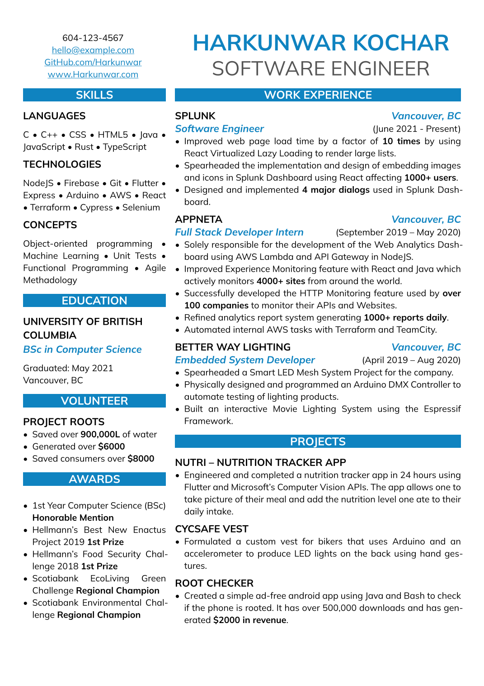
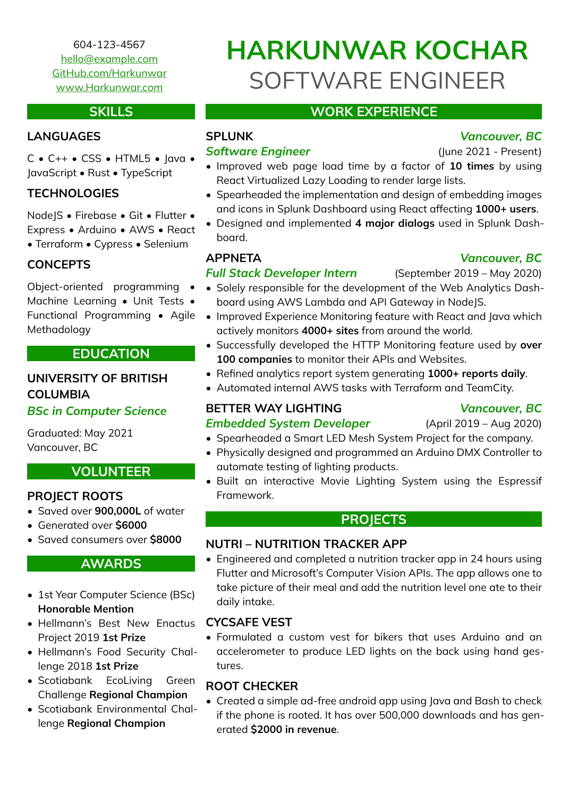

This is an Attractive Resume Template built with Typst, an open source Latex alternative written in Rust, and compiles to PDF.

To compile it to pdf, make sure typst is installed. The provided flake.nix and .envrc is useful if you have nix and direnv installed. This template using the Mulish Google Font and is provided in the `assets/fonts` directory.

Mirror link at Typst.app https://typst.app/project/rLlknWbYc8XMaZc45BHlMl

Preview:\

